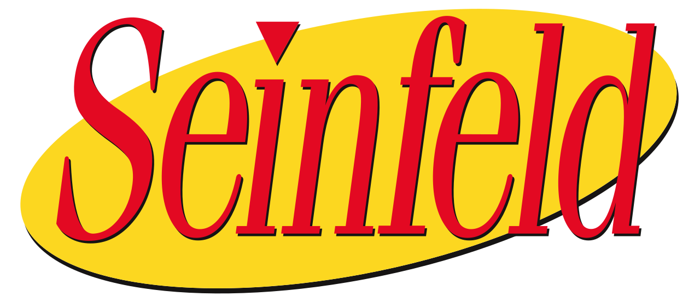

# Problem Statement:

Using dialogue from the television show Seinfeld, I am attempting to create a generative chatbot using a seq2seq model and accuracy as my objective performance metric. I will utilize the keras deep learning library to implement my project.

The Seinfeld dialogue dataset has been downloaded from Kaggle. The data set consists of diaglogue from the complete series.

https://www.kaggle.com/thec03u5/seinfeld-chronicles

The model I will use is a seq2seq, otherwise known as an encoder-decoder, model.

Risks and assumptions of data: The model that I am building uses a lot of RAM and computing power. Some strings of dialogue are too long to be useful and have to be discarded. This can negatively effect my model as the dialogue will no longer be a true back and forth conversation.

I will be using accuracy as a metric in training my encoder NN, but ultimately success will be determined subjectively, i.e. how convincing is the chatbot?

Please see my notebook, capstone-preprocess, for preliminary EDA and initial modeling. 

# Background:

In mid 2015, two big events occured in my life: 1) I became a father, 2) I injured my lumbar spine in a sporting accident that made it near impossible to walk for 2 months. Needless to say, this was a very trying time for my family. Upset that I couldn't contribute more to normal daily tasks, I took it upon myself to rock my son to sleep for every nap while he lay on my chest. We called these "Daddy Naps". As I was immobilized by child and spine, I had a lot of time for Netflix and Hulu. The first show I watched all of the way through was Seinfeld. I had never watched it before, but figured it might give me some good dad joke material for down the road. Thankfully, this tough moment passed and I became much stronger for it. The bond created between myself and my son is invaluable and the rest gave me the time to heal and research a game-plan to come back stronger.  

Fast-forward five years. I find myself in another tough moment: Losing my dream job due to COVID-19. I used Seinfeld as a medium while I heal up and bonded with my new born son. I figure, why not use it again to experiment with NLP and other data science techniques. This moment, too, shall pass and I will come out stronger. 

# Executive Summary:

My goal with this project was to venture into the world of NLP and create a chatbot that responsive, coherent and has functionality. I iterated through multiple variations of chatbots and have shared 3 in this notebook. Iteration 3: Seinfeld GPT-2 turned out to be the 'best', by my definition.

I have divided up my executive summary into 3 sections corresponding to each iteration.

## Seq2Seq Model

In preparation for the seq2seq model, the dataset was cleaned and missing values were removed. The dialogue included stage directions. The stage directions were removed. There were a few lines of dialogue that were very long. To make the model a bit more managable, the maximum length of dialogue was limited to 50 characters. The dialogue was then formatted properly to be accepted into the network. 

#### Issues and concerns:
When trained on all of the data, the model is very large. The filesize has been an issue when reading in to notebooks and python scripts. 

The hidden and cell states are somehow altered when reading in a model from keras load_model(). I trained a few models in Google Colaboratory and saved them to my personal machine. The model did not perform as well after reloading in the model.

Limiting the length of dialogue can impact the model negatively. The idea is that every line of dialogue is conversational. Cutting it short by length might make the dialogue disjointed and not perform well. Finding the correct type of data for this model is harder than actually implementing it!

#### Moving forward:
I would like to get to the bottom of the hidden and cell state issue to see if I can maintain performance level.

I would like to try this same model with a different data set. Short, conversational data would be the most appropriate. Online chat data would be great.

#### Conclusion:
Overall, the Seq2Seq model concept is very fascinating! I do believe there are better models architectures suited for this particular chatbot. I am eager to explore Chatterbot and GTP2 text generation. 

## Chatterbot

#### Issues and concerns:

#### Moving Forward:

#### Conclusions:

## GPT2

After playing around with GPT2 (Generative Pretrained Transformer-2), in a few online notebooks, I decided to create a chatbot with a slight variation. This chatbot doesn't chat 1:1 but rather places you in the middle of dialogue. The model generates multiple lines of code and I have parsed it down to managable chunks. Also, this iteration has much more functionality than the two previous bots. 

I utilized Google Colab for initial training. The aitextgen module works very well with Google and utilized Google Drive for accessing text files and saving large models.

### spaCy Recommender

Utilizing spaCy's built in word embeddings, this chatbot comes loaded with word embeddings for each Seinfeld episode's dialogue. The bot stores user chat information, vectorizes, creates embeddings and calculates the cosine similarity user_chat and every episode. 

The recommender utilizes the imdbpy api to grab episode names and plot. The recommender will also return a customized youtube search link for the episode of choice. 

### Character Classification

#### Issues and concerns:

The spaCy NLP file is too big. There must be a better way to summarize the text

#### Moving Forward:
Topic modeling to help with the recommender

#### Conclusions:

## Topic Modeling

